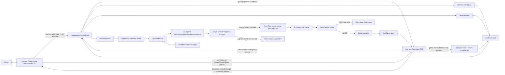

# 02. Архитектура и потоки

## Рекомендуемая топология

`PROPOSAL`: Controller интегрируется с локальным Codex app-server по `stdio` либо Unix socket. App-server WebSocket не используется в production baseline, потому что `VERIFIED` manual помечает его experimental/unsupported. Controller сохраняет `task_id ↔ root_thread_id ↔ turn_id` и projection событий, но canonical task state хранит самостоятельно.

`USER DECISION 2026-08-12`: один Codex-facing interface — единственная user-facing orchestration surface. OpenClaw, Qwen и implementation workers являются внутренними planes без отдельного обязательного UI. Это решение не утверждает, что существующий Codex desktop принимает arbitrary Controller envelopes или secure callbacks.

`DECISION REQUIRED / AD-15 / Technical + Security / H0`: выбрать и доказать delivery binding. Preferred `PROPOSAL`: personal Codex plugin + Controller MCP + MCP Apps custom UI, только если pinned live probe на target Codex desktop build подтверждает render, immutable preview bytes и secure authenticated UI→Controller callback. Официальная MCP Apps документация описывает ChatGPT и compatible hosts, но не доказывает поддержку конкретным Codex desktop. Fallback `PROPOSAL`: custom local Codex client на app-server, который сам рендерит Controller envelopes и имеет отдельный authenticated Controller channel; это новый Codex client/UI, не существующий desktop task UI. Если оба варианта не выполняют boundary, interface/approval route остаётся blocked. См. SRC-CX-12, SRC-CX-21 и AD-15.

Ни `mcpServer/elicitation/request`, ни built-in command/file/app approval, `tool/requestUserInput`, tool call/result, transcript text, natural-language «одобряю», root output или suggestion click не являются `OwnerDecisionEvent`. Root сохраняет `approvalPolicy=never`; decision приходит только по attested callback выбранного delivery binding и проверяется Controller.

## Control plane и data plane

### Control plane

Содержит policy versions, role registry, task state, leases, budgets, capability manifests/grants, approvals, kill switches и routes. Только authenticated local Controller изменяет control-plane records. Models получают проекцию нужных полей, а не write access.

### Data plane

Содержит raw inbound events, sanitized signals, context capsules, work artifacts, evidence и action payloads. Каждый переход создаёт новый immutable derivative с `parent_refs`, `policy_version`, `classification` и digest.

## Единственный ingress choke point

`USER REQUIREMENT`: каждый source byte проходит один и тот же Gate API до OpenClaw hooks, parsers, models, tools и cloud. К Gate относятся real-time webhook, polling, history/backfill, delivery retry/replay, attachment/transcript ingestion, derived parser jobs и scheduler/background reprocessing. Adapter не может вызывать downstream queue/compiler напрямую.

Gate атомарно сохраняет `(owner, adapter, account, conversation)` state: last accepted monotonic source sequence/version, scanned-through watermark, PD/quarantine latch, gap ranges и digest chain. Source without trustworthy sequence получает locally assigned monotonic ingest ordinal плюс provider cursor/version evidence; это не маскирует provider gap. Event `n+1` до подтверждённого scan `n`, older marker после newer event, duplicate с другим digest, cursor rollback либо `prior_scan_complete=false` latch’ит всю conversation в quarantine. Quarantine допускает только local reconciliation/rescan; cloud capsule, Codex request и tool route запрещены.

Attachments/transcripts регистрируются Gate как child parts до parser dispatch. Parse выполняется local-only, output получает minimum L2 и наследует conversation latch. Ни raw, ни derived attachment/transcript не входит в ContextCapsule/SafeEnvelope до отдельного exact declassification.

## Context planes

| Plane | Содержимое | Доступ |
|---|---|---|
| CP-0 Raw | полный allowlisted message/attachment/transcript | OpenClaw, local policy; не cloud |
| CP-1 PD | sticky local session и local output | Qwen + owner UI; tools/cloud denied |
| CP-2 Signal | bounded summary/facts/provenance/coverage | Controller; Codex только после egress gate |
| CP-3 Root | goals, specs, decisions, result summaries | Codex root; один outcome/thread |
| CP-4 Worker | WorkOrder + approved capsule + workspace | назначенный worker |
| CP-5 Evidence | artifacts/diffs/tests/receipts | reviewer/root targeted reads |
| CP-6 Authority | policies/grants/approvals/credentials refs | Controller/effectors; не model authority |
| CP-7 Audit | metadata, hashes, transitions, reason codes | operations/security |

## Нормальный поток

1. Ingress Gate проверяет allowlist/signature/cursor, persistent sequence/scan completeness и PD marker над source bytes до любого parser/model/tool route.
2. Только ordered/fully-scanned non-PD event collector нормализует и ставит encrypted queue record; остальные conversation latch’ятся в PD/quarantine.
3. Non-PD signal compiler создаёт `TaskSignal`; model suggestion может повысить risk/route, но не снять deny.
4. Controller коррелирует/deduplicates signal; chat text не становится prompt instruction.
5. Для frequent bounded question или bounded exploration создаётся Luna `ContextCapsule`; для decision/cross-domain work — root turn. Результат становится Controller envelope и показывается owner только через выбранный после AD-15 Codex-facing interface.
6. Codex создаёт `TaskSpec` и typed freeze proposal; после фиксации owner decisions Controller валидирует proposal и выполняет canonical freeze transition.
7. `PROPOSAL / H4 capability probe`: Controller формирует runtime-agnostic `WorkOrder` и запускает **отдельный** native Codex app-server либо `codex exec` instance с generated clean home/profile, isolated worktree и workspace-write task sandbox. Implementer не является root-spawned child: официально child inherits current sandbox/approval posture, а root остаётся read-only/`never` (SRC-CX-05, SRC-CX-18). Controller проверяет runtime attestation и наблюдает lifecycle.
8. Worker возвращает EvidenceBundle; independent reviewer — ReviewVerdict.
9. Codex предлагает accept/rework/block; Controller валидирует hashes/evidence и выполняет canonical transition. Accept не исполняет external effect.
10. Нужный effect создаёт ActionProposal; Controller детерминированно строит immutable preview bytes из exact payload/destination/reconciliation tuple, доставляет их по attested Codex-facing binding, принимает exact-bound `OwnerDecisionEvent`, затем выполняет approval/policy → one-use grant → deterministic effector → receipt. Missing/stale render receipt или mismatch блокирует effect.

## Codex integration boundaries

- Stable MVP surface: app-server `thread/start|resume|read`, `turn/start|interrupt`, streamed `turn/*`/`item/*`, per-turn `outputSchema` и sandbox.
- `thread/fork`, `turn/steer` и compaction допустимы только после integration tests; steering не принимает новые privileges.
- Experimental `dynamicTools`, `thread/inject_items`, process-spawn и WebSocket не входят в production baseline.
- `thread/shellCommand` запрещён harness, потому что manual указывает full access вне thread sandbox.
- Native Codex runtime является единственным model-worker substrate: Luna/Terra могут оставаться read-only subagents; implementer запускается отдельным app-server/`codex exec` instance, не child root. Controller не выводит authority из transcript, subagent calls или built-in approval/user-input events.

## Deployment units

1. `openduck-controller`: loopback/Unix-only API, state machine, schema validation.
2. `openclaw-sensor`: отдельная identity, read credentials only.
3. `policy-gateway`: no network; DLP, marker, capsule compiler.
4. `codex-app-server`: generated clean Codex home/profile, network false, restricted read roots, static MCP/skills/hooks/apps allowlist and start/resume attestation.
5. `qwen-runtime`: loopback Ollama, outbound blocked.
6. `codex-worker-runner`: separate native Codex app-server/`codex exec` process with generated clean per-task profile, isolated worktree and workspace-write task sandbox; exact launch surface probe-gated, WorkOrder contract не зависит от model slug/launcher.
7. `capability-broker/approval-registry`: local transactional store.
8. Effectors: separate process/credential per effect family.
9. `codex-facing-delivery-adapter`: появляется только после AD-15; personal plugin/MCP Apps binding либо custom local app-server client, с отдельным authenticated Controller callback.

`DECISION REQUIRED / Technical + Security / H0`: native processes with macOS sandbox profiles versus containers. Decision must consider app/UI access; no single runtime automatically receives all capabilities.
