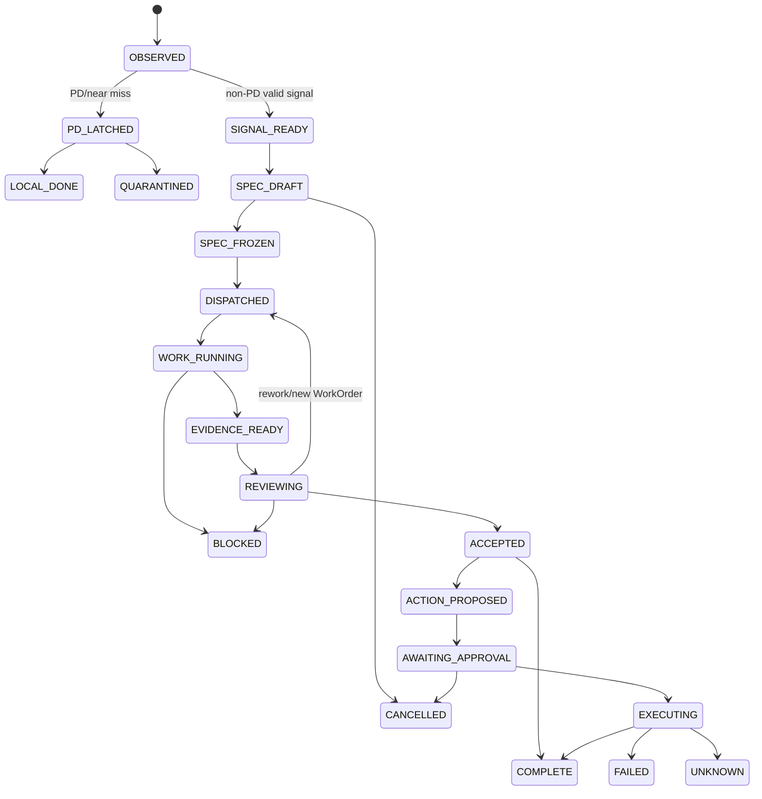

# 11. Observability, recovery и lifecycle

## Canonical task state machine

State transition record содержит entity/version, previous/new state, actor/principal, task/spec/action hashes, reason code, timestamp, policy version и audit ref. Controller выполняет optimistic concurrency/CAS; repeated event с тем же idempotency key безопасен.

## Codex thread projection

App-server thread/turn/item status — наблюдаемая execution projection, но не canonical task state. Controller:

- сохраняет thread/turn IDs и final authoritative `item/completed`/`turn/completed`;
- отслеживает `thread/status/changed`, waiting-on-approval, model reroute, token usage, compaction and errors;
- после restart читает stored thread, но сверяет active spec/policy hashes;
- при невозможности безопасного resume создаёт fresh thread из frozen spec/capsules, не копируя transcript wholesale;
- interrupt подтверждает остановку turn, но отдельно revokes outstanding grants/leases.

## Metrics

- ingest lag, queue depth, dedup/edit/delete/gap counts;
- signals by route/class/reason, PD/quarantine counts без content;
- ingress per-path decisions, per-conversation sequence/watermark/gap/replay/conflict counters and quarantine age;
- capsule bytes/tokens/coverage/staleness;
- root/Luna/implementer/reviewer latency, token/cost budgets, model/reroute;
- selected Codex-facing delivery binding/render receipt/status/approval-event validation, without preview body or auth material;
- WorkOrder lease/rework/block/accept rates;
- capability issued/denied/expired/consumed/replayed;
- approval requested/approved/rejected/expired/cancel-race;
- effect outcome/reconciliation/UNKNOWN;
- root runtime attestation match/mismatch by category (config/instructions/MCP/skills/hooks/apps/read roots/network), without sensitive paths/content;
- audit drops, schema failures, DLP denies, kill-switch state.

No metric label содержит sender, raw text, prompt, URL query, credential, absolute sensitive path или full command output.

## Audit chain

`PROPOSAL`: append-only local metadata journal с hash chaining and periodic signed checkpoints after Phase H6 review. Operational audit не является backup raw data. Audit access read-only; export — separate approval. Clock rollback, sequence gap и invalid chain raise incident.

## Recovery matrix

| Failure | Required behavior |
|---|---|
| OpenClaw/collector down | gap starts; no complete claim; bounded catch-up after recovery |
| Queue uncertain commit | poison queue/executor; reload/reconcile before lease |
| DLP/policy down | no signal cloud route; local metadata alert |
| Qwen down/OOM | PD local/manual; no fallback |
| Codex/app-server down | signals queue; no worker/action dispatch; resume/reconstruct from frozen state |
| Luna down | root queue or manual; no provider fallback unless same posture approved |
| Codex Implementer crash/lease expiry | inspect attestation/artifacts/effects; safe redispatch into a fresh clean profile/worktree only if no mutation uncertainty |
| Reviewer down | result cannot become accepted |
| Capability broker/approval DB down | mutations disabled |
| Effector timeout | UNKNOWN; provider reconciliation, no auto retry |
| Required MCP down | dependent route blocked; unrelated local monitoring continues |
| Disk full/corruption | stop writes/mutations, preserve readable evidence, owner-visible incident |

## Kill switches

Independent flags: `ingest_disabled`, `cloud_egress_disabled`, `dispatch_disabled`, `mutations_disabled`, per-adapter/provider/effector disable. Checks occur at entry and immediately before irreversible boundary. Kill switch does not claim rollback of already delivered effect and does not delete evidence.

## Incident minimum

Incident record contains category, affected scopes/time window, detection/evidence refs, capability/action IDs, exposure assessment, containment, purge/revocation/reconciliation status and owner decisions. Raw sensitive samples remain separately access-controlled.

`PROPOSAL / after AD-15`: all owner-visible lifecycle, blocked/incident status and action receipts are projected through the selected attested Codex-facing interface. Internal Controller/sensor/worker endpoints expose no alternate user workflow. Missing binding/render receipt, UI delivery/callback failure or current-preview mismatch blocks and does not authorize, consume or retry an effect.
