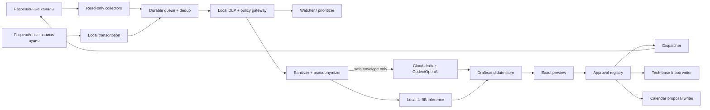

# 02. Системная архитектура

## Логическая схема

Это `PROPOSAL`; OpenClaw используется как orchestration/gateway foundation, а privacy- и approval-компоненты должны иметь собственные проверяемые policy boundaries.

## Компоненты и capability boundaries

| Компонент | Может | Не может |
|---|---|---|
| Collector | читать один allowlisted scope; нормализовать событие | отправлять, читать другие scopes, вызывать LLM |
| Queue/dedup | persist, lease, retry, deduplicate | интерпретировать контент, делать egress |
| Local DLP/policy gateway | назначать класс, применять deterministic rules, разрешать/отклонять route | отправлять сообщение, менять policy из контента |
| Watcher | локально классифицировать urgency/topic | исполнять действия |
| Sanitizer/pseudonymizer | удалить/заменить запрещённые поля; формировать envelope | rehydrate вне локальной границы |
| Local model | рекомендовать labels/extractions | быть окончательным DLP/approval решением, получать tools |
| Cloud drafter | вернуть schema-valid draft по safe envelope | видеть mapping псевдонимов, отправлять наружу |
| Approval registry | bind approval к action hash, TTL, approver | менять payload, самостоятельно исполнять |
| Dispatcher | отправить ровно approved reply; записать receipt | генерировать/редактировать, выбирать адресата |
| Tech-base writer | append/create в Inbox | редактировать существующие страницы, читать весь vault |
| Calendar writer | создать proposal/draft по approved candidate | update/delete или добавлять участников без approval |
| Local transcription | преобразовать разрешённое local audio | облачный upload по умолчанию, скрытая запись |

## Trust boundaries

- **TB-0 External platforms:** недоверенный контент и platform APIs. Sender text, files, quoted messages и meeting metadata считаются потенциальным prompt injection.
- **TB-1 Local host:** collectors, queue, policy, pseudonym map, approvals и restricted writers. Доступ ограничен отдельным OS identity/container profile; loopback не равен автоматической безопасности.
- **TB-2 OpenClaw gateway:** один доверенный оператор. `VERIFIED`: OpenClaw не является hostile multi-tenant boundary; multi-user требует отдельных gateway/OS boundaries.
- **TB-3 Cloud provider:** получает только L0/L1 safe envelope по явно разрешённому route; никогда не получает rehydration map.
- **TB-4 Durable destinations:** tech-base/calendar/channel имеют отдельные credentials и approval scope.
- **TB-5 Operator UI:** единственное место показа полного preview и принятия решения; защищается device/session authentication.

## Сессии и контекст

Session key строится детерминированно из `(owner_id, adapter_id, account_id, conversation_id, peer_or_thread_id)` и не используется как authorization token. Для каждого peer/thread — отдельная context window, отдельная policy и отдельный pseudonym namespace. Cross-session recall по умолчанию выключен. Group и DM не объединяются. Identity linking между платформами — только вручную подтверждённое действие.

`VERIFIED`: OpenClaw поддерживает session scopes и session maintenance. Проектная надстройка обязана дополнительно проверять authorization на каждом событии и action; routing selector не доказывает право.

## Потоки данных

### Inbound

1. Adapter проверяет allowlist и подписывает normalized event своим adapter identity.
2. Queue присваивает `event_id`, `content_digest`, `ingested_at`, сохраняет encrypted payload.
3. Dedup проверяет `(adapter, account, source_event_id, source_version)`.
4. Policy gateway запускает deterministic detectors, затем optional local model recommendation.
5. Watcher формирует notification; raw body показывается только локально согласно UI policy.

### Cloud drafting

1. Sanitizer получает минимальное context window.
2. Создаёт стабильные локальные псевдонимы и удаляет запрещённые поля.
3. Deterministic post-scan валидирует schema и отсутствие known secrets/L2/L3 patterns.
4. Egress engine вычисляет decision `allow | ask | deny` и rule IDs.
5. Только `allow` и отдельный подтверждённый `ask` уходят в выбранный endpoint.
6. Ответ проходит schema validation, injection/content filtering и сохраняется как untrusted draft.

### Actions

Draft→Preview→Approval Pending→Approved→Leased→Delivered/Failed. Payload не мутируется после вычисления hash. Для tech-base, calendar и reply создаются разные action records и approvals.

## Развёртывание

`PROPOSAL`: один локальный runtime на Mac, сервисы с отдельными процессами/UID или sandbox profiles, localhost-only internal APIs, encrypted local state, macOS Keychain для ссылок на credentials. Реальная форма (native services или containers) — `DECISION REQUIRED / Technical owner / Phase 0`, после оценки OpenClaw channel access и macOS sleep constraints.

## Контракты интерфейсов

- Все сообщения — versioned JSON, `additionalProperties: false` на boundary schemas.
- Каждый record содержит `schema_version`, trace ID, timestamps UTC + source timezone, classification, provenance.
- Команды action side подписываются/аутентифицируются и несут `idempotency_key`.
- Policy decisions содержат `policy_version`, `matched_rule_ids`, `decision`, но operational logs не содержат raw body.
- Unknown schema/version отклоняется; backward compatibility не подразумевается.

## Architectural decision gates

| Gate | Решение | Владелец | Срок |
|---|---|---|---|
| ADG-01 | native processes vs containers; OS identity | Technical + Security owner | до Phase 1 |
| ADG-02 | первый channel adapter и API mode | Product + Security owner | до Phase 2 |
| ADG-03 | OpenAI API project vs Codex subscription route | Data owner + Security owner | до Phase 3 |
| ADG-04 | tech-base adapter/root/backup | Product owner | до Phase 5 |
| ADG-05 | calendar provider/scopes | Product + Security owner | до Phase 6 |
| ADG-06 | call sources and consent UX | Legal/privacy owner | до Phase 7 |
