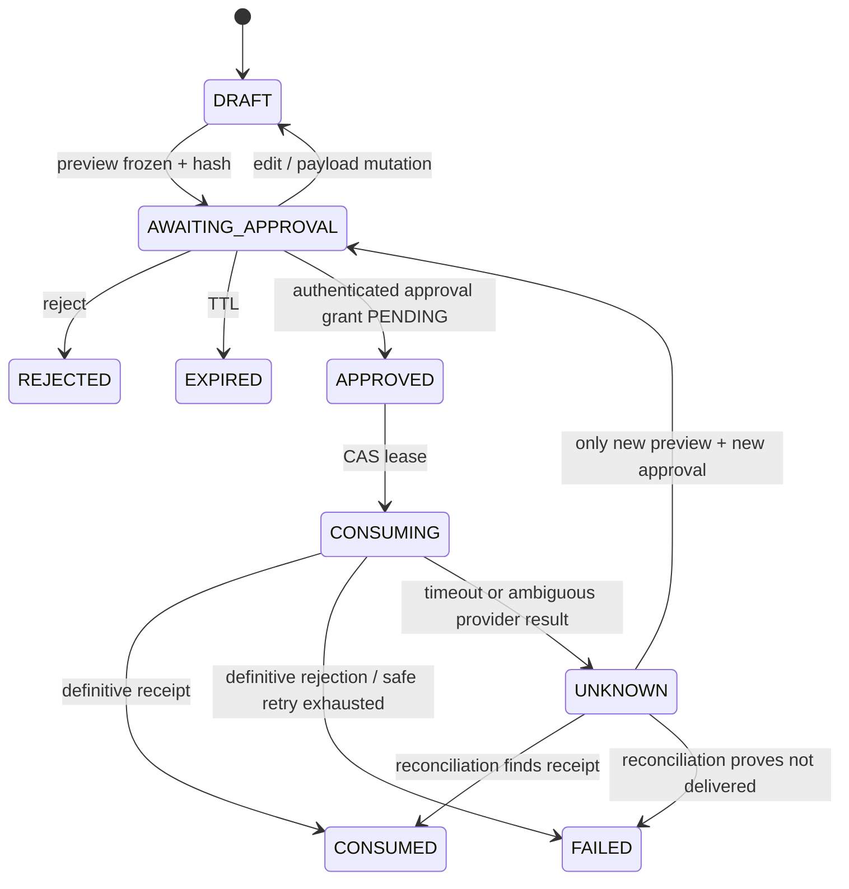

# 06. Workflow и approval gates

## Инвариант подтверждения

Approval разрешает ровно одно действие над ровно одним canonical payload. Он не является разрешением «делать похожие действия», «отвечать этому человеку дальше» или «исправить мелочь и отправить».

Canonical payload для reply включает:

```json
{
  "schema_version": "approved-action.v1",
  "action_type": "reply.send",
  "channel_id": "canonical-channel-id",
  "account_id": "canonical-account-id",
  "conversation_id": "canonical-conversation-id",
  "recipient_ids": ["canonical-recipient-id"],
  "thread_id": "canonical-thread-id-or-null",
  "body_utf8": "точный текст с нормализованными переводами строк",
  "attachments": [{"content_digest": "sha256:...", "display_name": "file.pdf", "size": 1234}],
  "reply_to_source_id": "source-id-or-null"
}
```

Canonical serialization — однозначная versioned схема (например, RFC 8785 JSON Canonicalization Scheme; выбор фиксируется ADR). `payload_hash = SHA-256(canonical_bytes)`. Preview отображает значения, из которых получены **те же bytes**, включая recipient/channel/account/thread/body/attachments. Любая байтовая мутация, нормализация после approval или замена attachment инвалидирует approval.

## Approval record

Минимальные поля: `approval_id`, `action_type`, `payload_hash`, `preview_version`, `approver_id`, `requested_at`, `approved_at`, `expires_at`, `status`, `policy_version`, `source_refs`, `nonce`. TTL — `DECISION REQUIRED / Security owner / Phase 4`; стартовое предложение 10 минут для reply и 30 минут для durable records. Approver authentication и session binding обязательны.

После явного нажатия владельцем registry создаёт одноразовый approval grant со статусом `PENDING`. При начале исполнения dispatcher атомарно делает CAS `PENDING → CONSUMED`; grant никогда не возвращается в `PENDING`, даже если сетевой outcome стал `UNKNOWN`. Состояние самого action отслеживается отдельно (`APPROVED → CONSUMING → CONSUMED|FAILED|UNKNOWN`). Это не позволяет двум workers использовать один grant.

### Minimum approval authentication contract

До Phase 4 обязательны: authenticated owner session; recent re-authentication непосредственно для mutation (окно определяет DR-08); уникальные per-approval nonce и UI challenge, связанные с payload hash; CSRF token и strict Origin/Host protection для UI; one-time opaque action handle, не содержащий destination/body; atomic cancel CAS. Audit хранит auth method/class, actor pseudonymous ID, re-auth age и transition result, но не cookie, bearer token, biometric data или sensitive session material.

Non-owner, stale/revoked session, повторный nonce/challenge, неверный Origin/CSRF и повторно использованный action handle отклоняются. Cancel конкурирует с execute через один transactional state: только один CAS может победить; при неясном локальном commit результат fail-closed и требует reconciliation, не отправку.

## State machine



Dispatcher одновременно потребляет grant через CAS `PENDING → CONSUMED` и переводит action `APPROVED → CONSUMING` в одной локальной транзакции, затем одноразово `CONSUMING → CONSUMED|FAILED|UNKNOWN`. Конкурентный executor проигрывает CAS. `UNKNOWN` никогда не ретраится автоматически как новая отправка: сначала provider reconciliation по idempotency key/source correlation. Если доказать отсутствие доставки нельзя, требуется решение владельца и новый approval.

Delivery policy берётся из versioned CapabilityManifest. При `native` idempotency или `delivery_reconciliation=supported` retry/reconcile допускается только по documented adapter rules и с исходным payload/key. При `provider_idempotency=client_only|none` и `delivery_reconciliation=unsupported` разрешена ровно одна попытка: timeout → `UNKNOWN`, без automatic retry. Exactly-once delivery не обещается ни в одном режиме.

## Reply workflow

1. Event проходит ingest/DLP/session selection.
2. Draft создаётся local/cloud route и считается untrusted.
3. Destination resolver возвращает один canonical destination; иначе workflow `BLOCKED_AMBIGUOUS`.
4. UI показывает exact preview и источник.
5. `Edit` возвращает в DRAFT; `Approve` создаёт immutable record.
6. Dispatcher проверяет TTL, approver, action type, current hash, current policy, destination availability.
7. CAS lease и один send attempt.
8. Definitive receipt → CONSUMED; rejection → FAILED; timeout → UNKNOWN + reconciliation.
9. UI сообщает фактический outcome, не предполагаемый.

Retry разрешён только если CapabilityManifest и доказанное pre-delivery состояние делают его безопасным, и только с тем же idempotency key/payload. Для non-reconcilable adapter retry после attempt запрещён. Provider rate-limit backoff bounded и применяется до передачи payload либо согласно доказанной provider semantics. Новый body/recipient/thread — новый action.

## Candidate workflow: agreement, task, deadline

Extractor создаёт candidate, а не факт:

- `candidate_type`: agreement | decision | promise | task | deadline;
- source locator и bounded excerpt;
- source author, timestamp, timezone;
- subject/owner/due expression;
- confidence и extraction rationale;
- `status`: proposed | needs_clarification | accepted | rejected | superseded.

Если источник говорит «позже», «на следующей неделе» без однозначной явной даты в принятой временной базе, deadline остаётся `needs_clarification`, `due_at = null`. Модель не додумывает дату. Принятие candidate — отдельный approval `agreement.accept` или `task.accept`; запись в tech-base — следующий отдельный `techbase.write` approval либо явно утверждённый compound transaction с двумя видимыми effects (не в MVP).

## Calendar workflow

1. Candidate извлекает явные start/end/timezone/participants или отмечает missing fields.
2. Система спрашивает недостающие данные; относительная/двусмысленная дата не нормализуется молча.
3. Preview показывает exact calendar, title, start/end/timezone, location, attendees и reminders.
4. Approval `calendar.propose` создаёт proposal/draft. Приглашение участникам — отдельный future action.
5. Conflict/free-busy result информативен и не меняет время автоматически.

## Tech-base workflow

1. Summary/candidates получают human acceptance.
2. Renderer создаёт deterministic Markdown preview с source references.
3. Approval `techbase.write` bound к exact relative Inbox path + content hash.
4. Writer использует заранее открытый trusted Inbox root descriptor и FD-relative traversal/create с `no-follow` на каждом path component; string path нужен только preview, не authority.
5. Exclusive atomic create выполняется относительно root descriptor, после чего inode/realpath сверяются с ожидаемым root и opened handle до commit/fsync. Любая гонка/замена компонента блокирует операцию.
6. Check-then-open по строковому пути, append/overwrite существующего файла и редактирование knowledge pages запрещены.

## Разделение approvals

| Effect | Action type | Может покрыть другое действие? |
|---|---|---|
| Ответ | `reply.send` | Нет |
| Принять договорённость | `agreement.accept` | Нет |
| Принять задачу | `task.accept` | Нет |
| Записать Inbox | `techbase.write` | Нет |
| Создать calendar proposal | `calendar.propose` | Нет |
| Отправить invitation | вне MVP | Нет |

## Emergency controls

- Global `egress_disabled` и `mutations_disabled` проверяются непосредственно перед CAS/send.
- Per-adapter disable/revoke.
- Pending/approved actions можно cancel только atomic CAS в том же registry, что и execute; победивший cancel делает grant непотребляемым. CONSUMING/UNKNOWN требуют reconciliation.
- Kill switch не удаляет evidence и не пытается «отозвать» уже доставленное сообщение.
