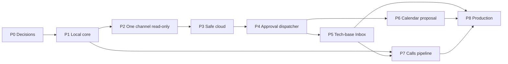

# 10. Roadmap и work breakdown

## Release bands

- **MVP (Phases 0–4):** synthetic/manual copy → один read-only канал → safe cloud envelope → approval-gated reply. Никаких звонков, calendar writes, WhatsApp/iMessage.
- **Pilot (Phases 5–7):** tech-base Inbox, calendar proposal, официальный transcript import и локальная транскрипция; ограниченные реальные scopes.
- **Production (Phase 8):** hardening, локальные encrypted backups/recovery (после отдельного
  owner approval), SLO, supply-chain, scale и формальный operational ownership.

Каждая phase начинается в более строгом режиме и повышает capabilities только после exit criteria. Rollback — отключение добавленной capability, а не удаление evidence.

## Phase 0 — решения, threat baseline и synthetic workspace

**Deliverables:**

- `OD-001` назначить Product/Data, Technical и Security/privacy owners.
- `OD-002` утвердить prohibited data, L0–L3, retention, legal/organizational gates.
- `OD-003` выбрать deployment isolation, secret store, disk/backup posture.
- `OD-004` выбрать первый канал и создать отдельный test account/workspace без реальных данных.
- `OD-005` выбрать cloud posture: strict API, explicit OAuth или local-only.
- `OD-006` зафиксировать ADRs, data-flow и kill-switch runbook.
- `OD-007` создать и проверить полную FR/NFR→contract→OD→AC→evidence traceability matrix; назначить её обязательным phase-exit artifact.
- `OD-008` утвердить minimum host security baseline и форму evidence: FileVault, screen lock, отдельный OS UID/sandbox или formally accepted equivalent, non-world-readable state, Keychain-only references, localhost/firewall verification, encrypted-backup decision.

**Dependencies:** нет. **Exit:** все DR-01…DR-12 для Phase 1 имеют owner/evidence; synthetic corpus и outbound-denied environment готовы; traceability matrix полна и прошла статическую проверку; host baseline имеет владельца и проверяемый checklist. **Rollback:** удалить test app/webhook, revoke test credentials, оставить спецификацию/evidence.

## Phase 1 — local core и manual-copy shadow mode

**Deliverables:**

- `OD-101` versioned InboundEvent/Provenance/Candidate schemas.
- `OD-102` encrypted queue, leases, dedup и redacted audit.
- `OD-103` deterministic DLP/policy engine и L0–L3 fixtures.
- `OD-104` benchmark local 4–9B candidates против baseline; pin digest.
- `OD-105` sanitizer/pseudonym map и local-only rehydration.
- `OD-106` watcher/notification для manual copy; no external accounts.
- `OD-107` purge queue/index/cache/DLQ и degraded-mode tests.
- `OD-108` применить и записать host-baseline evidence до реальных данных: FileVault/screen lock; отдельный runtime UID/sandbox или formally accepted equivalent; state/config modes исключают group/world read; только Keychain/secret-store refs; localhost bind/firewall probe; encrypted-backup decision.

**Dependencies:** OD-001…008. **Exit:** synthetic prompt injection/secrets не дают egress/action; p95/RSS baseline зафиксированы; local model failure корректно деградирует; OD-108 evidence подписано Security owner; traceability обновлена. **Rollback:** stopped mode, purge synthetic state/model cache.

## Phase 2 — один канал read-only

**Deliverables:**

- `OD-201` capability probe, ToS/admin evidence и exact scopes.
- `OD-202` collector с allowlist и отдельным read credential.
- `OD-203` webhook signature/timestamp/nonce либо secure polling cursor.
- `OD-204` edit/delete/version, dedup, bounded backfill и gap semantics.
- `OD-205` read-only canary, health/status и revoke/offboarding.

**Dependencies:** Phase 1, DR-01 и подтверждённый OD-108. **Exit:** host-baseline evidence актуально; ни одного write scope/tool; bad signature/replay rejected; sleep/offline gap честно отражён; corpus events обнаружены с согласованной полнотой; revocation test и traceability green. **Rollback:** stop collector, revoke read credential, purge scope state/indexes/caches/DLQ/backups по policy.

## Phase 3 — safe cloud envelope

**Deliverables:**

- `OD-301` machine-readable safe-envelope schema и canonical digest.
- `OD-302` `allow|ask|deny` router, endpoint/auth-profile allowlist.
- `OD-303` strict post-scan; raw L2/L3 and secret egress tests.
- `OD-304` OpenAI/Codex adapter с `store`/data-control evidence для выбранного route.
- `OD-305` cloud output validator, local rehydration и usage audit.

**Dependencies:** Phase 2, DR-05/06. **Exit:** captured network tests доказывают only L0/L1 envelopes; strict class rejects OAuth; provider outage не вызывает silent failover. **Rollback:** egress kill switch; local/manual mode.

## Phase 4 — immutable approval и reply dispatcher

**Deliverables:**

- `OD-401` exact preview, canonical serialization, SHA-256 hash и TTL.
- `OD-402` authenticated approval registry и CAS state machine.
- `OD-402A` minimum approval auth: authenticated owner session, recent mutation re-auth, nonce/challenge, CSRF/Origin protection, one-time handle, cancel-vs-execute CAS и non-sensitive auth audit.
- `OD-403` destination resolver по canonical ID; ambiguity rejection.
- `OD-404` dispatcher с отдельным minimal write credential и action-enabled gate по CapabilityManifest.
- `OD-405` idempotency/receipt semantics, `UNKNOWN` reconciliation и one-attempt policy для non-reconcilable adapters; exactly-once не заявляется.
- `OD-406` one-peer canary и approval audit.

**Dependencies:** Phase 3, separate write credential, reviewed CapabilityManifest и DR-08. **Exit:** byte mutation/expiry инвалидируют approval; non-owner/stale/replayed UI/cancel-race tests fail-closed; wrong-recipient/concurrency/обе timeout branches/kill-switch tests проходят; ни одной mutation без approval; traceability green. **Rollback:** mutations kill switch, revoke write credential; сохранить/reconcile UNKNOWN.

## Phase 5 — tech-base Inbox

**Deliverables:**

- `OD-501` подтвердить backend/root; filesystem Markdown остаётся assumption до решения.
- `OD-502` summary/candidate renderer и human acceptance.
- `OD-503` Inbox-only writer: trusted root descriptor, FD-relative no-follow traversal, exclusive create, post-create inode/realpath verification; никаких check-then-open string paths.
- `OD-504` отдельный `techbase.write` preview/approval и backup policy.

**Dependencies:** Phase 4, DR-07. **Exit:** writer не читает/редактирует вне Inbox; source provenance/version/status обязательны; traversal/collision/symlink-TOCTOU race tests проходят; traceability green. **Rollback:** disable writer, оставить созданные файлы для ручного разбора; не удалять пользовательские записи автоматически.

## Phase 6 — календарные proposals

**Deliverables:**

- `OD-601` provider capability/scopes и calendar ID selection.
- `OD-602` strict date/time/timezone extractor с no-inferred-deadline rule.
- `OD-603` proposal preview и отдельный approval.
- `OD-604` conflict/free-busy read при разрешении; no attendees/invitations.

**Dependencies:** Phase 4, DR-08. **Exit:** ambiguous date remains null; wrong calendar blocked; no invitations; proposal outcome has receipt. **Rollback:** disable/revoke calendar writer; local candidates остаются drafts.

## Phase 7 — официальный transcript и local calls pipeline

**Deliverables:**

- `OD-701` platform/consent policy и visible workflow.
- `OD-702` official transcript/recording import only; quarantine.
- `OD-703` local transcription/diarization benchmark, no-network test.
- `OD-704` report/candidate review и separate approvals.
- `OD-705` raw audio/transcript purge policy.

**Dependencies:** Phase 1, Phase 5, DR-09/legal gate. **Exit:** no import without consent record; raw audio egress blocked; speaker uncertainty visible; purge covers derivatives. **Rollback:** disable importer/transcriber, purge raw according to policy.

## Phase 8 — Production hardening и scale

**Deliverables:**

- `OD-801` advanced host/process hardening поверх Phase 1 baseline: tighter sandbox profiles, integrity monitoring, periodic exposure/permission revalidation и formally reviewed compensating controls.
- `OD-802` SBOM, pinned dependencies/model digests, upgrade canary/rollback.
- `OD-803` SLO/alerts/on-call ownership, capacity/load/backpressure tests.
- `OD-804` спроектировать и реализовать **только после отдельного owner approval** local encrypted
  backup; провести outbound-disabled restore drill и собрать RPO/RTO evidence. До этого backup
  capability остаётся disabled/unimplemented (`backups.enabled=false`), backup-копии не создаются,
  cloud backup запрещён.
- `OD-805` security audit, penetration/fault injection, privacy review.
- `OD-806` purge subject/source/provider and incident/lost-device drills.
- `OD-807` controlled expansion to another API-supported channel only after independent gate.

**Dependencies:** required Pilot phases. **Exit:** acceptance suite green; restore does not send; runbooks exercised; residual risks signed by owners; финальная traceability matrix complete без orphan FR/NFR/OD/AC. **Rollback:** return to one-channel read-only or stopped; revoke affected adapters.

## Dependency map

## Work item Definition of Done

Для каждого OD-ID: requirements traced; threat impact reviewed; schemas/versioning documented; unit/integration/negative tests; redacted telemetry; rollback и purge; no secret in repo/log/fixture; owner acceptance evidence. Обновлённый [14-requirements-traceability.md](14-requirements-traceability.md) без orphan FR/NFR и с фактическими evidence links — обязательная часть DoD и каждого Phase exit. Реальный account enablement и dependency install остаются отдельными авторизованными действиями, не следуют автоматически из этой спецификации.
